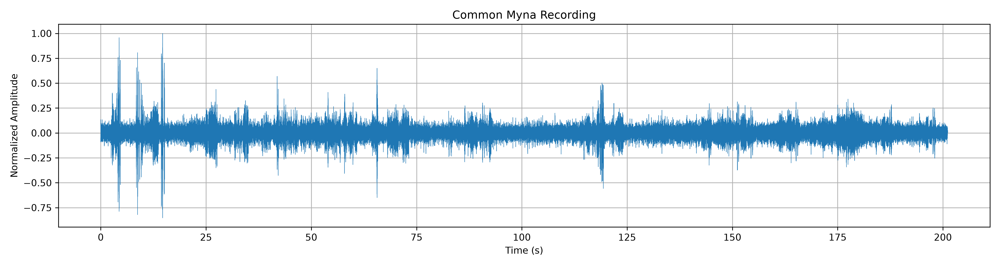
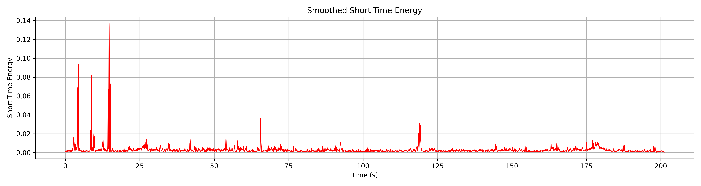
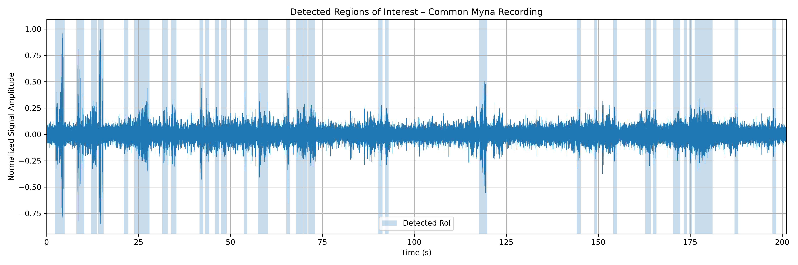
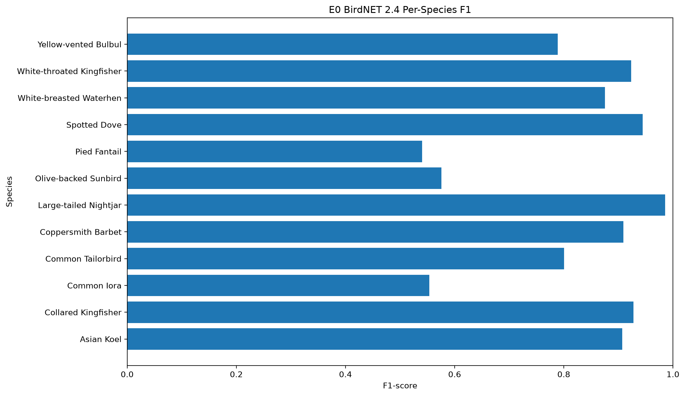
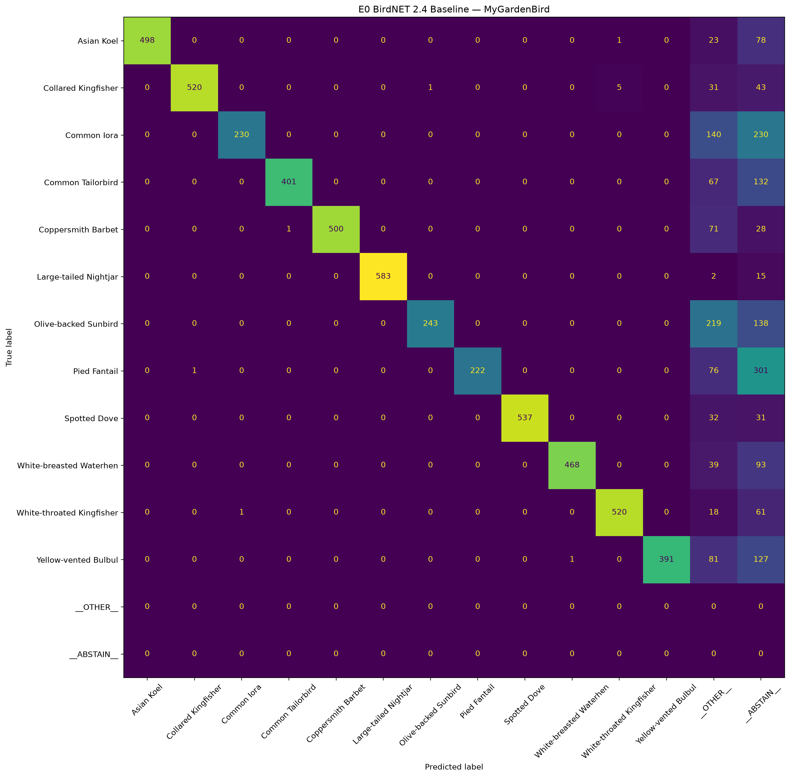

# BirdCall Monitoring System


# Phase 1 - Audio Preprocessing & Classification

## Objectives

- [x] Load and normalise audio recordings
- [x] Detect bird vocalisations using Short-Time Energy
- [x] Visualise waveform and detected RoIs
- [x] Extract detected RoIs
- [x] Apply high-pass noise filtering
- [x] Integrate BirdNET
- [x] Generate classification results

---


## Visual Outputs

### 1. Normalised Waveform

Shows the amplitude of the recording after normalisation.



---

### 2. Short-Time Energy

Shows how the Short-Time Energy changes throughout the recording.

This graph was used to determine the detection threshold for identifying possible bird calls.



---

### 3. Detected Regions of Interest

Displays the waveform together with every detected RoI.

The highlighted regions correspond to the audio snippets extracted for BirdNET classification.



---

## RoI Extraction Experiments

Several extraction strategies were evaluated.

| Strategy | Result |
|----------|--------|
| Variable-length RoIs | Good |
| Fixed 3-second windows (surrounding audio) | Lower classification performance |
| Exact RoIs padded to 3 seconds | Best overall performance |
| 2-second minimum duration | Similar results but lower average confidence |

### Final Decision

The final implementation extracts the exact detected RoI.

- RoIs shorter than 3 seconds are padded with silence.
- RoIs longer than 3 seconds are unchanged.
- BirdNET internally analyses long recordings using multiple 3 second intervals.

This maintained the detected bird vocalisation while avoiding unrelated surrounding audio.

---

## BirdNET Classification


Outputs:

- Filtered audio snippets
- Classification CSV
- Species predictions
- Confidence scores

---

---

# Phase 2 - Backend API & Database

## Objectives

### Project Setup

* [x] FastAPI project structure
* [x] PostgreSQL integration
* [x] SQLAlchemy Async ORM
* [x] Alembic migrations
* [x] Configuration management
* [x] Global exception handling

---

### Device Management

* [x] Device database model
* [x] Validation
* [x] Repository pattern
* [x] Service layer

---

### Recording Management

* [x] Recording database model
* [x] Secure audio upload endpoint
* [x] WAV metadata extraction
* [x] Duplicate upload detection
* [x] Capture session support
* [x] ROI metadata support
* [x] Recording retrieval
* [x] Recording deletion

---

### BirdNET Processing Pipeline

Processing workflow:

```text
ROI Upload
    ↓
Recording stored (Pending)
    ↓
Background Task
    ↓
BirdNET Analysis
    ↓
Detection Storage
    ↓
Recording Completed
```

Completed:

* [x] BirdNET service
* [x] Automatic background processing
* [x] Recording processing lifecycle
* [x] Failed processing handling

---

### Detection Management

* [x] Detection database model
* [x] Detection repository
* [x] Detection service
* [x] Detection schemas
* [x] Detection storage
* [x] Detection retrieval API
* [x] Recording-specific detection API

---

## Backend REST API

### Devices

* [x] POST `/api/v1/devices`
* [x] GET `/api/v1/devices`
* [x] GET `/api/v1/devices/{id}`
* [x] PATCH `/api/v1/devices/{id}`
* [x] DELETE `/api/v1/devices/{id}`

### Recordings

* [x] POST `/api/v1/recordings`
* [x] GET `/api/v1/recordings`
* [x] GET `/api/v1/recordings/{id}`
* [x] GET `/api/v1/recordings/{id}/detections`
* [x] DELETE `/api/v1/recordings/{id}`

### Detections

* [x] GET `/api/v1/detections`
* [x] GET `/api/v1/detections/{id}`

### System

* [x] GET `/health`
* [x] GET `/ready`

---

## Current Backend Status

### Completed

* ✔ Asynchronous FastAPI backend
* ✔ PostgreSQL database integration
* ✔ Device management module
* ✔ Recording upload pipeline
* ✔ Audio validation and metadata extraction
* ✔ Background BirdNET processing
* ✔ Detection persistence
* ✔ Detection retrieval APIs
* ✔ Repository–Service architecture
* ✔ Centralised exception handling

---

## Next Development Milestones

* [ ] Species statistics and analytics endpoints
* [ ] Recording download endpoint
* [ ] Authentication and authorization
* [ ] Frontend dashboard integration
* [ ] ESP32 end-to-end integration
* [ ] Production deployment
* [ ] Monitoring and logging improvements


## Phase 3 — BirdNET Baseline Evaluation and Performance Analysis


### Existing BirdNET Backend Integration

The backend currently uses:

- BirdNET Acoustic Model 2.4
- TensorFlow backend
- Minimum confidence threshold: `0.25`
- Maximum predictions per interval: `5`
- Background-thread inference
- PostgreSQL detection persistence
- Processing states:
  - `pending`
  - `processing`
  - `completed`
  - `failed`

The complete inference pipeline has been verified successfully:

```text
Audio ROI Upload
        ↓
FastAPI Recording Endpoint
        ↓
Recording stored in PostgreSQL
        ↓
Background Processing Task
        ↓
BirdNET 2.4 Inference
        ↓
Prediction Filtering
        ↓
Detection Records
        ↓
PostgreSQL
```


## Evaluation Dataset — MyGardenBird

The MyGardenBird dataset was selected as the first controlled BirdNET benchmark.


### Dataset Inspection Results

```text
Total WAV files:       7200
Species/classes:       12
Clips per species:     600
Sample rate:           16000 Hz
Channels:              Mono
Bit depth:             16-bit
Minimum duration:      3.0 s
Maximum duration:      3.0 s
Average duration:      3.0 s
```

The 12 evaluated species are:

1. Asian Koel
2. Collared Kingfisher
3. Common Iora
4. Common Tailorbird
5. Coppersmith Barbet
6. Large-tailed Nightjar
7. Olive-backed Sunbird
8. Pied Fantail
9. Spotted Dove
10. White-breasted Waterhen
11. White-throated Kingfisher
12. Yellow-vented Bulbul

The dataset is balanced, with exactly 600 clips belonging to each species.

The complete dataset therefore contains:

```text
7200 clips × 3 seconds
=
21600 seconds
=
6 hours of labelled bird audio
```

---

## Standard BirdNET 2.4 Baseline

The first experiment evaluated the existing BirdNET model without retraining or changing its model parameters.

### Configuration

```text
Model:                    BirdNET Acoustic 2.4
Backend:                  TensorFlow
Dataset:                  MyGardenBird
Clips:                    7200
Species:                  12
Audio duration:           6 hours
Preprocessing:            None
Confidence threshold:     0.25
Top-K:                    5
Batch size:               16
Inference workers:        2
Audio producers:          2
Species filtering:        Disabled
Geographic filtering:     Disabled
```

Batched inference was used instead of calling BirdNET separately for every audio file.

This significantly improved efficency.

---

## Classification Results

After correction of the Top-K evaluation logic, the current full-dataset baseline results are:

| Metric                          |        Result |
| ------------------------------- | ------------: |
| Evaluated clips                 |         7,200 |
| Species                         |            12 |
| Correct Top-1 classifications   | 5,113 / 7,200 |
| Top-1 Accuracy                  |    **71.01%** |
| Top-3 Accuracy                  |    **73.86%** |
| Top-5 Accuracy                  |    **73.88%** |
| Macro Precision                 |    **0.9978** |
| Macro Recall                    |    **0.7101** |
| Macro F1                        |    **0.8110** |
| Weighted F1                     |    **0.8110** |
| Abstention Rate                 |    **17.74%** |
| Outside-Dataset Prediction Rate |    **11.10%** |
| Mean Top-1 Confidence           |    **0.8380** |
| Median Top-1 Confidence         |    **0.9559** |

---

## Per-Species Performance

| Species                   | Precision | Recall |        F1 |
| ------------------------- | --------: | -----: | --------: |
| Asian Koel                |     1.000 |  0.830 | **0.907** |
| Collared Kingfisher       |     0.998 |  0.867 | **0.928** |
| Common Iora               |     0.996 |  0.383 | **0.554** |
| Common Tailorbird         |     0.998 |  0.668 | **0.800** |
| Coppersmith Barbet        |     1.000 |  0.833 | **0.909** |
| Large-tailed Nightjar     |     1.000 |  0.972 | **0.986** |
| Olive-backed Sunbird      |     0.996 |  0.405 | **0.576** |
| Pied Fantail              |     1.000 |  0.370 | **0.540** |
| Spotted Dove              |     1.000 |  0.895 | **0.945** |
| White-breasted Waterhen   |     0.998 |  0.780 | **0.876** |
| White-throated Kingfisher |     0.989 |  0.867 | **0.924** |
| Yellow-vented Bulbul      |     1.000 |  0.652 | **0.789** |

---

### Per-Species F1 Visualization

The following graph shows the substantial species-dependent variation in BirdNET classification performance.



The best-performing class was **Large-tailed Nightjar**, with an F1-score of approximately `0.986`.

Other strongly performing species included:

* Spotted Dove — `0.945`
* Collared Kingfisher — `0.928`
* White-throated Kingfisher — `0.924`
* Coppersmith Barbet — `0.909`
* Asian Koel — `0.907`

Lower recall was observed for:

* Common Iora — F1 `0.554`
* Olive-backed Sunbird — F1 `0.576`
* Pied Fantail — F1 `0.540`

---

## Confusion Matrix

A confusion matrix was generated for the complete 7,200-clip evaluation.



Two additional output states are included:

* `__ABSTAIN__` — no BirdNET prediction exceeded the confidence threshold.
* `__OTHER__` — BirdNET produced a prediction above the threshold, but the predicted species did not belong to the 12 benchmark classes.

At the current threshold:

```text
Abstentions:                 1277 / 7200 = 17.74%
Outside-dataset predictions:  799 / 7200 = 11.10%
```

---

## Pied Fantail Failure Investigation

The initial E0 evaluation produced an unexpected result:

```text
Pied Fantail F1 = 0.000
```

The analysis examined all 600 Pied Fantail clips.

Initial classification behaviour showed:

```text
Correct Top-1:              0 / 600
Abstentions:                301 / 600
Clips with predictions:     299 / 600
```

However, inspection of BirdNET's actual predictions showed that the most common prediction was:

```text
Scientific name:
Rhipidura javanica

BirdNET common name:
Malaysian Pied-Fantail
```

This prediction occurred 238 times and frequently had very high confidence, including values above `0.99`.

The MyGardenBird dataset directory instead used:

```text
Pied Fantail
```

Therefore, the original evaluation logic incorrectly treated:

```text
Pied Fantail
```

and:

```text
Malaysian Pied-Fantail
```

as different classes.

This was an mismatch rather than complete BirdNET classification failure.

Therefore the following changes were done:

```text
MyGardenBird:
Pied Fantail

BirdNET:
Malaysian Pied-Fantail

Scientific identifier:
Rhipidura javanica
```

After correcting the taxonomy mapping, Pied Fantail performance changed from:

```text
F1 = 0.000
```

to:

```text
Precision = 1.000
Recall    = 0.370
F1        = 0.540
```

The overall Macro F1 also increased from approximately:

```text
0.766
```

to:

```text
0.811
```
---


## BirdNET Computational Performance

Batched inference was evaluated using the complete dataset.

The experiment processed:

```text
7200 WAV files
6 hours of audio
```

in approximately:

```text
403 seconds
≈ 6.7 minutes
```

The measured performance was:

| Metric                         |               Result |
| ------------------------------ | -------------------: |
| Total audio duration           |             21,600 s |
| Inference wall time            |               ~403 s |
| Average wall time per 3 s clip |             ~0.056 s |
| Real-Time Factor               |              ~0.0187 |
| Processing speed               | **53.55× real-time** |

This indicates that server-side BirdNET inference is computationally feasible for the proposed monitoring system.

Approximately one hour of audio can theoretically be processed substantially faster than one hour of wall-clock time on the current development machine.

This supports the architecture decision to perform BirdNET inference on the backend rather than attempting to run the classifier directly on the ESP32.

---

### High Precision

Most benchmark classes achieved precision close to `1.0`.

This indicates that when BirdNET produces a sufficiently confident prediction corresponding to one of the evaluated classes, that prediction is generally reliable.

### Lower Recall

Recall varies considerably by species.

Particularly low recall was observed for:

* Common Iora
* Olive-backed Sunbird
* Pied Fantail

This suggests that BirdNET may frequently recognize these recordings with insufficient confidence or classify them as species outside the benchmark set.

### Confidence Threshold Importance

At the current confidence threshold of `0.25`:

```text
17.74% of recordings resulted in abstention.
```


---


## Current Phase 3 Status

* [x] BirdNET 2.4 production integration
* [x] Background BirdNET inference
* [x] PostgreSQL detection persistence
* [x] MyGardenBird dataset acquisition
* [x] Dataset integrity inspection
* [x] 7,200-clip controlled BirdNET evaluation
* [x] Batched BirdNET inference implementation
* [x] Per-species precision/recall/F1 analysis
* [x] Confusion matrix generation
* [x] Per-species F1 visualization
* [x] Inference throughput analysis
* [x] Pied Fantail taxonomy failure investigation
* [x] Taxonomy mapping correction
* [x] Top-K evaluation correction
* [ ] Low-confidence inference capture
* [ ] E1 confidence-threshold sweep
* [ ] SNR-performance analysis
* [ ] BirdNET sensitivity analysis
* [ ] Frequency-band analysis
* [ ] Edge preprocessing vs raw-audio comparison
* [ ] Independent field-recording evaluation

```

